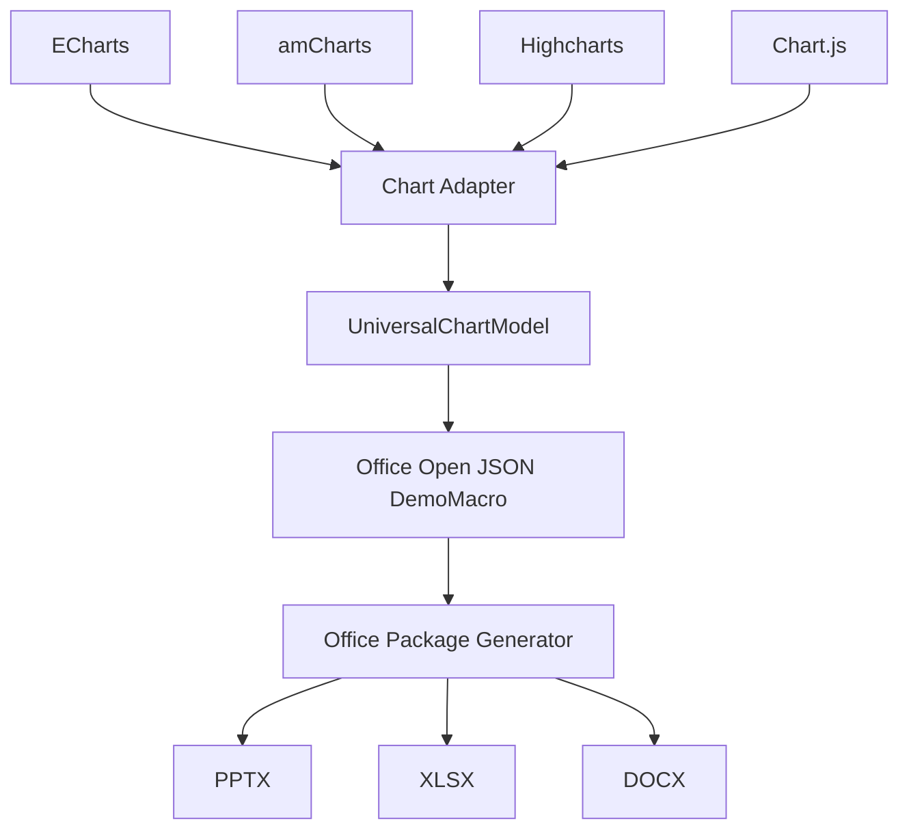

# Architecture

chart-ooxml-adapter is the conversion stage between JavaScript chart configs and Office document generators. Its only product is a DemoMacro-compatible Office Open JSON chart object: an object tree that preserves OOXML ChartML semantics without serializing XML or building a package.



## Boundaries

| This library | Other libraries |
| --- | --- |
| Detect source chart config | Create PPTX/XLSX/DOCX ZIP packages |
| Normalize to `UniversalChartModel` | Create relationships and content types |
| Build `OfficeOpenChart` object trees | Create media / fallback images |
| Validate against the Office Open chart JSON Schema | Write `document.xml`, slide layouts, worksheet drawing anchors |

The Office Open JSON object is host-agnostic. It does not include slide coordinates, worksheet cell anchors, or Word floating-frame placement. PowerPoint, Excel, Word, document editors, and AI document pipelines all consume the same chart object and add their own host wrappers.

## Layers

```text
src/adapters/   Chart.js, ECharts, Highcharts, amCharts → UniversalChartModel
src/model/      UniversalChartModel parse/validate
src/office/     OfficeOpenTypes, OfficeOpenChartBuilder, OfficeOpenChartJson
schemas/        JSON Schema for OfficeOpenChart
```

`src/office/` is the output layer named **OfficeOpenChartJson**, not a generic “chart JSON”, so it stays distinct from `UniversalChartModel`.
